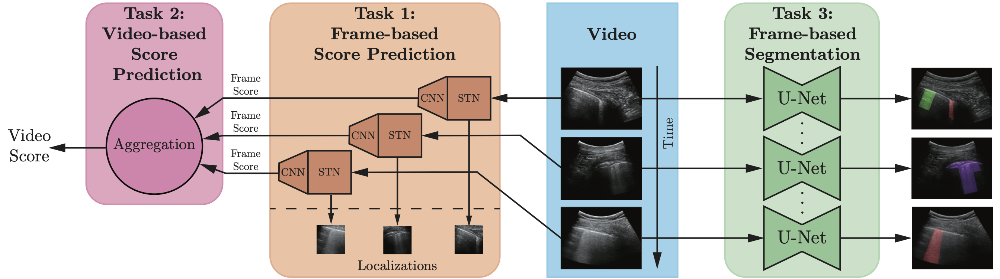
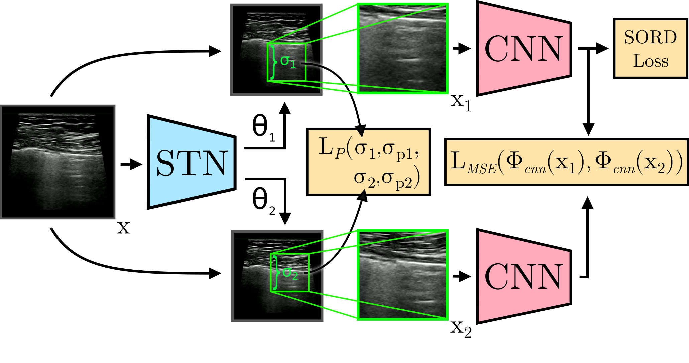
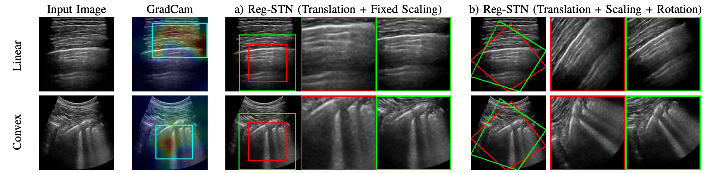
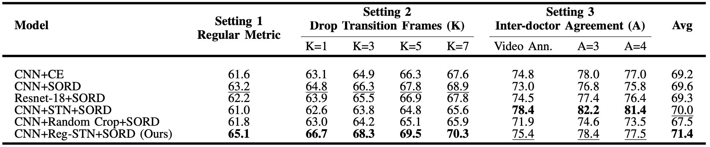

# DL4covidUltrasound

<p align="center">
     <br />
    <em> 
    Figure 1. Overview of the different tasks considered in this work.
    </em>
</p>

## 2. Proposed Methods

Our method foresees two main components:

- A frame-based predictor exploiting STN [1] to recognize the promising region crop in the input data.
- The aggregation of the frame-based predictions.

### 2.1 Frame-based Score Prediction

<p align="center">
     <br />
    <em> 
    Figure 2. Illustration of the architecture for frame-based score prediction.
    </em>
</p>


And here is an example of localization obtained with our STN module.


<p align="center">
     <br />
    <em> 
    Figure 3. Examples of the image crops produced by the Reg-STN network.
    </em>
</p>


### 2.2 Video-based Score Prediction

Here is an example of video-based predictions exploiting our aggregation strategy of frame-based predictions.

<p align="center">
    
    <em> 
    Video 1. Visualization of the results of our video-based score aggregation method.
    </em>

</p>


## 3. Results

### 3.1 Frame-based Score Prediction

<p align="center">
     <br />
    <em> 
    Table 1. F1 scores (%) for the frame-based classification under different evaluation settings explained in the paper.
    Best and second best F1 scores (%) are in bold and underlines, respectively.
    </em>
</p>


### 3.2 Video-based Score Prediction

<p align="center">
     <br />
    <em> 
    Table 2. Mean and standard deviation of weighted F1 score, precision and recall for the proposed video-based classification method and baselines.
    </em>
</p>

### 3.2 Frame-based Segmentation


## 4. Installation


### Requirements

We try to minimize requirements. Assuming you are using `Python 3.7+`, you can install requirements:
```
python -m pip install -r requirements.txt
```

## 5. Usage

### Evaluation


### Training


## 6. Manuscript

The pre-print copy of our manuscript can be found at [paper]()

## 7. Citation

Please cite our paper if you find the work useful:

    @article{DL4covidUltrasound,
    title={TTT},
    author={aaa},
    Journal = {arXiv},
    year={2020}
    }

 
## 8. Acknowledgements

We thanks [ProM Facility](https://polomeccatronica.it/cosa-offriamo/laboratori-prom) for their contributions.