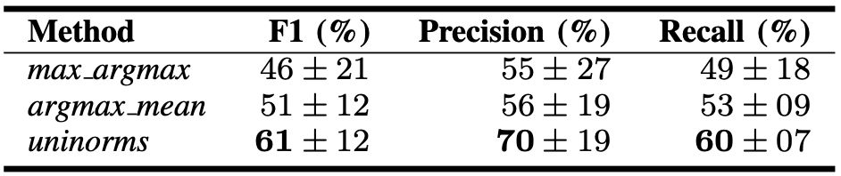

# Deep learning for classification and localization of COVID-19 markers in point-of-care lungultrasound

<p align="center">
     <br />
    <em> 
    Figure 1. Overview of the different tasks considered in this work.
    </em>
</p>

> **Deep learning for classification and localization of COVID-19 markers in point-of-care lungultrasound**<br>
> [Subhankar Roy](https://github.com/roysubhankar), [Willi Menapace](https://github.com/willi-menapace), Sebastiaan Oei, Ben Luijten, [Enrico Fini](https://github.com/DonkeyShot21), [Cristiano Saltori](https://github.com/saltoricristiano), Iris Huijben, Nishith Chennakeshava, Federico Mento, Alessandro Sentelli, Emanuele Peschiera, Riccardo Trevisan, Giovanni Maschietto, Elena Torri, Riccardo Inchingolo, Andrea Smargiassi, Gino Soldati, [Paolo Rota](https://github.com/paolorota), [Andrea Passerini](https://github.com/andreapasserini), Ruud J.G. van Sloun, [Elisa Ricci](http://elisaricci.eu/), Libertario Demi<br>
> In IEEE Transactions on Medical Imaging.<br>

> Paper: [IEEE link](https://ieeexplore.ieee.org/document/9093068)<br>

> **Abstract:** *Deep learning (DL) has proved successful inmedical  imaging  and,  in  the  wake  of  the  recent  COVID-19 pandemic, some works have started to investigate DL-based  solutions  for  the  assisted  diagnosis  of  lung  diseases. While existing works focus on CT scans, this paper studies  the  application  of  DL  techniques  for  the  analysisof  lung  ultrasonography  (LUS)  images.  Specifically,  we present  a  novel  fully-annotated  dataset  of  LUS  images collected from several Italian hospitals, with labels indicating the degree of disease severity at a frame-level, video-level,  and  pixel-level  (segmentation  masks).  Leveraging these data, we introduce several deep models that address relevant  tasks  for  the  automatic  analysis  of  LUS  images. In  particular,  we  present  a  novel  deep  network,  derived from Spatial Transformer Networks, which simultaneously predicts  the  disease  severity  score  associated  to  a  input frame  and  provides  localization  of  pathological  artefacts in a weakly-supervised way.  Furthermore, we introduce a new method based on uninorms for effective frame score aggregation  at  a  video-level.  Finally,  we  benchmark  state of the art deep models for estimating pixel-level segmentations of COVID-19 imaging biomarkers. Experiments on the proposed  dataset  demonstrate  satisfactory  results  on  all the considered tasks, paving the way to future research on DL for the assisted diagnosis of COVID-19 from LUS data.*

## 2. Proposed Methods

Our method foresees two main components:

- A frame-based predictor exploiting a novel deep architecture based on STN [1] that provides the disease severity score and a weakly-supervised localization of pathological artefacts.
- A video-based score predictor based on uninorms that performs aggregation of the frame-based scores.

### 2.1 Frame-based Score Prediction

<p align="center">
     <br />
    <em> 
    Figure 2. Illustration of the proposed Reg-STN architecture for frame-based score prediction.
    </em>
</p>

## 3. Results

### 3.1 Frame-based Score Prediction

<p align="center">
     <br />
    <em> 
    Table 1. F1 scores (%) for the frame-based classification under different evaluation settings explained in the paper.
    Best and second best F1 scores (%) are in bold and underlines, respectively.
    </em>
</p>

<p align="center">
     <br />
    <em> 
    Figure 3. Examples of weakly-supervised localization results of pathological artefacts produced by the Reg-STN network.
    </em>
</p>

<p align="center">
    
    <em> 
    Video 1. Examples of frame-based predictions produced by our proposed Reg-STN model.
    </em>

</p>

### 3.2 Video-based Score Prediction

<p align="center">
     <br />
    <em> 
    Table 2. Mean and standard deviation of weighted F1 score, precision and recall for the proposed video-based classification method and baselines.
    </em>
</p>

### 3.2 Frame-based Segmentation

Results coming soon

## 4. Installation

### Requirements

The project requires `Python 3.7+`. To install the dependencies, run:
```
python -m pip install -r requirements.txt
```

## 5. Dataset
The ICLUS dataset is available [here](https://www.disi.unitn.it/iclus). For dataset related queries, please drop an email to libertario.demi@unitn.it, in case the 
dataset that was used for the experiments are not available on the iclus website.

## 6. Usage

#### Frame-based Score Prediction
1. To use the exact train-test split used in our paper, please download the ```frames``` folder containing the extracted frames from [this link](https://www.disi.unitn.it/iclus) and place the folder under the dataset/ folder. If unavailable, please drop an email to libertario.demi@unitn.it

2. The frame-based score predictor can be trained by running the following commands from the root folder:
- for fixed scaling and trainable translation model in the paper
```
python frame-score-predictor/train.py --fixed_scale
```

- for trainable scaling, rotation and translation model in the paper
```
python frame-score-predictor/train.py
```

#### Video-based Score Prediction

The video-based score predictor can be trained by running the following command inside the `video_score_predictor` directory

```
python aggregator.py --use_sord --setting=kfolds --lr=0.01 --tnorm=product --zero_score_gap=0.5 --loss=ce --epoch=30 --earlystop=last --init_neutral=0. --lr_gamma=1 --off_diagonal=min --testfile '' --expname=<experiment_name> 'data/frame_predictions.pkl' 'data/video_annotations.xlsx' 'data/video_annotations_to_video_names.xlsx' <output_path>
```

## 7. Citation

Please cite our paper if you find the work useful:

    @article{DL4covidUltrasound,
    author={S. Roy and W. Menapace and S. Oei and B. Luijten and E. Fini and C. Saltori and I. Huijben and N. Chennakeshava and F. Mento and A. Sentelli and E. Peschiera and R. Trevisan and G. Maschietto and E. Torri and R. Inchingolo and A. Smargiassi and G. Soldati and P. Rota and A. Passerini and R. J. G. Van Sloun and E. Ricci and L. Demi},
    journal={IEEE Transactions on Medical Imaging}, 
    title={Deep learning for classification and localization of COVID-19 markers in point-of-care lung ultrasound}, 
    year={2020}
    }

 
## 8. Acknowledgements

We thank the Caritro Deep Learning Lab of [ProM Facility](https://promfacility.eu/#/) who made available their GPUs for the current work. We also thank [Fondazione VRT](https://www.fondazionevrt.it/) for financial support [COVID-19 CALL 2020 Grant #1]

## 9. License

This work is distributed under the Creative Commons Attribution-NonCommercial-ShareAlike 4.0 International Public License
